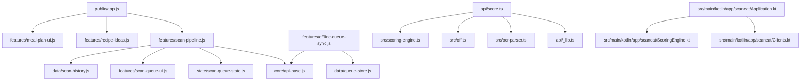

# Dependency Graph Snapshot

Generated manually from the current module boundaries to make feature ownership
visible until a bundler-based graph is introduced.

Use this file as the review checklist when splitting large modules or moving API
validation so callers do not bypass shared hardening.
